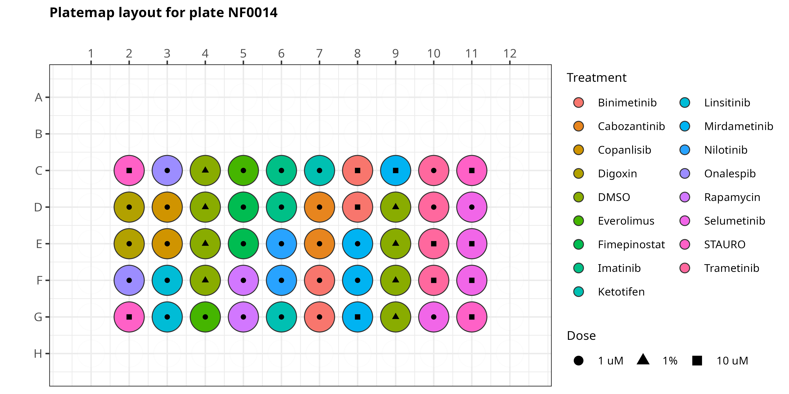

# GFF NF1 organoid image profiling

In this repository, we perform image analysis and image-based profiling on NF1 organoids derived from patients treated with a modified Cell Painting assay.

In our assay, we have the following channels:

- 405 = nucleus (Hoechst)
- 488 = endoplasmic reticulum (ER)
- 555 = actin, Golgi, and plasma membrane (AGP)
- 640 = mitochondria (Mito)
- TRANS = Brightfield

## Preliminary data

We have collected a preliminary plate of data with includes NF1 organoids derived from patients, which contain multiple different cell types (e.g., Schwann cells, fibroblasts, etc.).
This plate contains 16 treatments (either 1 uM or 10uM dose) and DMSO 1%.
The layout is as shown below:



## Environments

We utilize three environments for our repository.

1. [CellProfiler environment](./cellprofiler_env.yml): This environment installs CellProfiler, which we use for the illumination correction and feature extraction modules.
2. [R environment](./r_env.yml): This environment is specific to R, which we use for generating figures.
3. [Preprocessing environment](./preprocessing_env.yml): This environment installs preprocessing softwares (pycytominer, CytoTable, coSMicQC) to format the morphological readouts as single-cell profiles.

These environments can be installed either via conda or mamba.
Below is an example of how to install via the terminal.

```bash
# Make sure to be in this repo as the current directory
mamba env create -f ...
```
